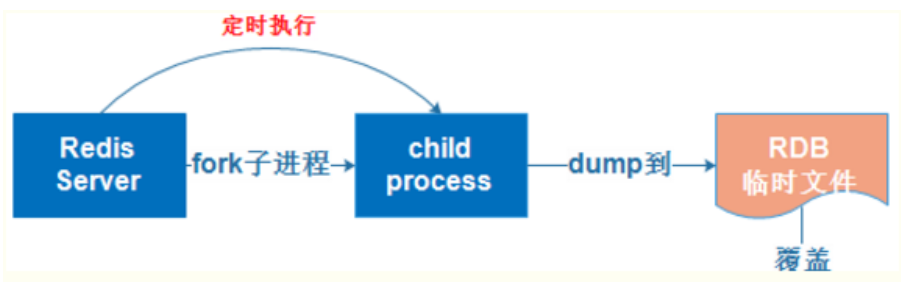
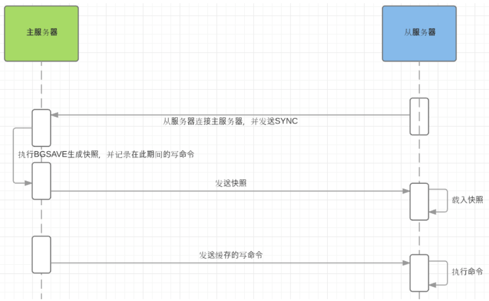
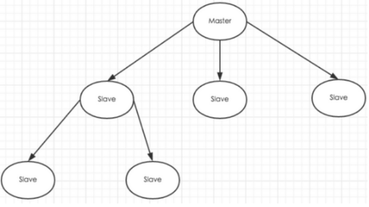
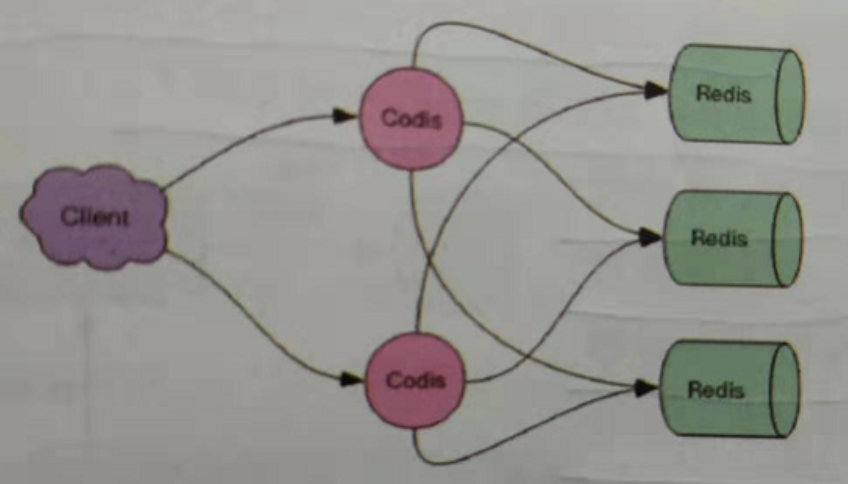

# 01.redis持久化方式

## 1.1 CPA原理

- 1、CPA原理是分布式存储理论的基石：C(一致性)；A(可用性)；P(分区容忍性);

- 2、当主从网络无法连通时，修改操作无法同步到节点，所以“一致性”无法满足

- 3、除非我们牺牲“可用性”，也就是暂停分布式节点服务，不再提供修改数据功能，直到网络恢复

- `一句话概括CAP: 当网络分区发生时，一致性和可用性两难全`

## 1.2 全量同步（快照同步）: RDB

 </img>

- 注：`Redis全量复制一般发生在Slave初始化阶段，这时Slave需要将Master上的所有数据都复制一份`

- 1）从服务器连接主服务器，发送SYNC命令；

- 2）主服务器接收到SYNC命名后，开始执行BGSAVE命令生成RDB文件并使用缓冲区记录此后执行的所有写命令；

- 3）主服务器BGSAVE执行完后，向所有从服务器发送快照文件，并在发送期间继续记录被执行的写命令；

- 4）从服务器收到快照文件后丢弃所有旧数据，载入收到的快照；

- 5）主服务器快照发送完毕后开始向从服务器发送缓冲区中的写命令；

- 6）从服务器完成对快照的载入，开始接收命令请求，并执行来自主服务器缓冲区的写命令；

- 7）`完成上面几个步骤后就完成了从服务器数据初始化的所有操作，从服务器此时可以接收来自用户的读请求。`

 </img>

## 1.3 增量同步：AOF

 </img>

- 1、Redis增量复制是指Slave初始化后开始正常工作时主服务器发生的写操作同步到从服务器的过程。 

- 2、增量复制的过程主要是主服务器每执行一个写命令就会向从服务器发送相同的写命令，从服务器接收并执行收到的写命令。

## 1.4 redis主从同步策略

- 1、主从刚刚连接的时候，进行全量同步；全同步结束后，进行增量同步。

- 2、当然，如果有需要，slave 在任何时候都可以发起全量同步。

- 3、redis 策略是，无论如何，首先会尝试进行增量同步，如不成功，要求从机进行全量同步。

## 1.5 注意点

- 如果多个Slave断线了，需要重启的时候，因为只要Slave启动，就会发送sync请求和主机全量同步
- 当多个同时出现的时候，可能会导致Master IO剧增宕机。

# 02.redis集群集中模式

## 2.1 redis主从

- 1、和MySQL主从复制的原因一样，Redis虽然读取写入的速度都特别快，但是也会产生读压力特别大的情况。
- 2、为了分担读压力，Redis支持主从复制，Redis的主从结构可以采用一主多从或者级联结构。
- 3、Redis主从复制可以根据是否是全量分为全量同步和增量同步。
- 注：redis主节点Master挂掉时，运维让从节点Slave接管（`redis主从默认无法自动切换，需要运维手动切换`）

 </img>

## 2.2 哨兵模式

### 2.2.1 sentinel作用

- 1.当用Redis做主从方案时，假如master宕机，Redis本身无法自动进行主备切换

- 2.而Redis-sentinel本身也是一个独立运行的进程，它能监控多个master-slave集群，发现master宕机后能进行自动切换。

### 2.2.2 sentinel原理

- 1.sentinel负责持续监控主节点的健康，当主节挂掉时，自动选择一个最优的从节点切换成主节点

- 2.从节点来连接集群时会首先连接sentinel，通过sentinel来查询主节点的地址

- 3.当主节点发生故障时，sentinel会将最新的主节点地址告诉客户端，可以实现无需重启自动切换redis

### 2.2.3 Sentinel支持集群

- 1.只使用单个sentinel进程来监控redis集群是不可靠的，当sentinel进程宕掉后sentinel本身也有单点问题

- 2.如果有多个sentinel，redis的客户端可以随意地连接任意一个sentinel来获得关于redis集群中的信息。

### 2.2.4 Sentinel版本

- 1.Sentinel当前稳定版本称为Sentinel 2，Redis2.8和Redis3.0附带稳定的哨兵版本

- 2.安装完redis-3.2.8后，redis-3.2.8/src/redis-sentinel启动程序 redis-3.2.8/sentinel.conf是配置文件。

### 2.3.5 哨兵模式配置

https://www.cnblogs.com/xiaonq/p/12348184.html

## 2.3 codis

### 2.3.1 为什么会出现codis

- 1.在大数据高并发场景下，单个redis实例往往会无法应对

- 2.首先redis内存不易过大，内存太大会导致rdb文件过大，导致主从同步时间过长

- 3.其次在CPU利用率中上，单个redis实例只能利用单核，数据量太大，压力就会特别大

### 2.3.2 什么是codis

- 1.codis是redis集群解决方案之一，codis是GO语言开发的代理中间件

- 2.当客户端向codis发送指令时，codis负责将指令转发给后面的redis实例来执行，并将返回结果转发给客户端

### 2.3.3 codis部署方案

- 1.单个codis代理支撑的QPS比较有限，通过启动多个codis代理可以显著增加整体QPS

- 2.多codis还能起到容灾功能，挂掉一个codis代理还有很多codis代理可以继续服务

 </img>

### 2.3.4 codis分片的原理

- 1.codis负责将特定key转发到特定redis实例，codis默认将所有key划分为1024个槽位

- 2.首先会对客户端传来的key进行crc32计算hash值，然后将hash后的整数值对1024进行取模，这个余数就是对应的key槽位

- 3.每个槽位都会唯一映射到后面的多个redis实例之一，codis会在内存中维护槽位和redis实例的映射关系

- 4.这样有了上面key对应的槽位，那么它应该转发到那个redis实例就很明确了

- 5.槽位数量默认是1024，如果集群中节点较多，建议将这个数值大一些，比如2048,4096

### 2.3.5 不同codis槽位如何同步

- 1.如果codis槽位值存在内存中，那么不同的codis实例间的槽位关系得不到同步

- 2.所以codis还需要一个分布式配置存储的数据库专门来持久化槽位关系

- 3.codis将槽位关系存储在zookeeper中，并且提供一个dashboard可以来观察和修改槽位关系