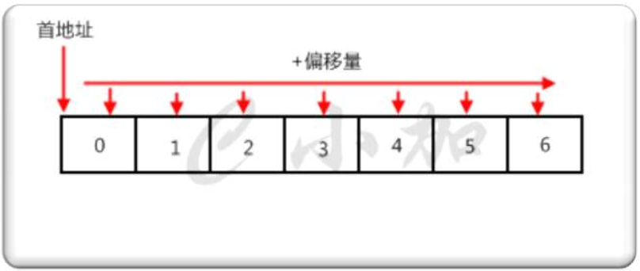
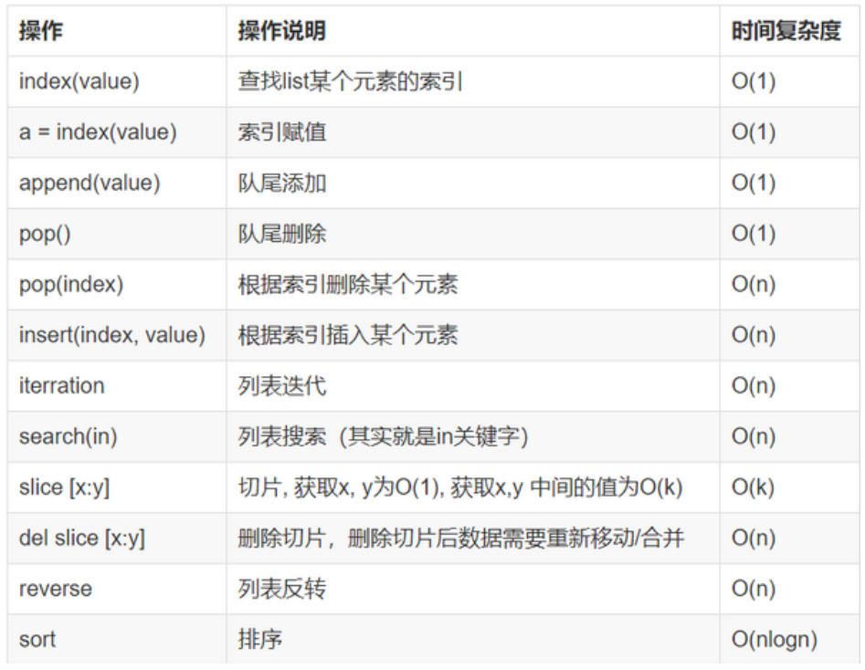

https://www.cnblogs.com/xiaonq/category/1168368.html

# 00.数据结构中的一些概念

## 1 数据结构是什么

- 1、简单来说，数据结构就是设计数据以何种方式存储在计算机中
- 2、比如：列表，集合，与字典 等都是一种数据结构
- 3、程序=数据结构+算法

## 2 数据结构与数据类型

- 1）`数据类型`：
  - 说明：数据类型是==一个值的集合和定义在此集合上一组操作==（通常是增删改查或者操作读写的方法）的总称
  - 数据类型：==int、str、boolean、byte==

- 2）`数据结构`：
  - 说明：==数据以什么方式构成，如何进行存储==（数据结构是数据类型中的一种：结构类型）
  - 数据结构`：数组、栈、队列、链表、树`、图、堆、散列表等
  - python数据结构：列表、集合、字典、元祖


# 01.栈

https://www.cnblogs.com/xiaonq/p/8574655.html#i2

## 1.1 栈定义

- 1、`栈的定义`
  - 栈是一种数据集合 ，可以理解为只能在一端进行插入或删除操作的列表
- 2、`栈的特点`
  - 后进先出（last-in, first-out）
- 3、`栈的概念`
  - 栈顶，栈底 
- 4、`栈的基本操作`
  - 进栈（压栈）：push
  - 出栈：pop
  - 取栈顶：gettop

## 1.2 python实现栈

```python
#! /usr/bin/env python
# -*- coding: utf-8 -*-
class Stack(object):

    def __init__(self):
        self.stack = []              # 初始化一个栈

    def push(self,item):             # 入栈
        self.stack.append(item)

    def gettop(self):                # 获取栈顶元素
        return self.stack[-1]

    def pop(self):                   # 出栈
        return self.stack.pop()

if __name__ == '__main__':
    s = Stack()
    s.push(1)
    s.push(2)
    print(s.stack)
```


# 02.队列

https://www.cnblogs.com/xiaonq/p/8574655.html#i3

## 2.1 队列定义

- 1、队列是一个数据集合，仅允许在列表的一端进行插入，另一端进行删除
- 2、插入的一端称为队尾（rear），插入动作叫进队或入队
- 3、进行删除的一端称为对头（front），删除动作称为出队
- 4、队列性质：先进先出（First-in, First-out）
- 5、双向队列：队列的两端都允许进行进队和出队操作

## 2.2 队列使用方法

```python
from queue import Queue
#1. 基本FIFO队列  先进先出 FIFO即First in First Out,先进先出
#2. maxsize设置队列中，数据上限，小于或等于0则不限制，容器中大于这个数则阻塞，直到队列中的数据被消掉
q = Queue(maxsize=0)

#3. 写入队列数据
q.put(0)
q.put(1)
q.put(2)

#4. 输出当前队列所有数据
print(q.queue)

#5. 删除队列数据，并返回该数据
q.get()

#6. 输也所有队列数据
print(q.queue)
```

## 2.3 队列应用场景

- 1.队列主要的功能是在多个进程间共享数据，实现业务解耦，提高效率
- 2.生产者线程只需要把任务放入队列中，消费者线程只需要到队列中取数据进行处理
- `注：队列与列表区别`
  - 列表中数据虽然是排列的，但数据被取走后还会保留，而==队列中这个容器的数据被取后将不会保留==


# 03.链表

https://www.cnblogs.com/xiaonq/p/8574655.html#i4

## 3.1 单链表定义

- 注：链表中每个元素都是一个对象，每个对象称为一个节点
- 每个节点包含两部分：
  - `数据域`： 存放当前节点数据
  - `指针域`： 指向下一个节点的内存地址

 </img>

## 3.2 python模拟单链表

```python
class Node(object):
    def __init__(self, item,next=None):
        self.item = item
        self.next = next
        
l = Node(1,Node(2,Node(3,Node(4))))
print(l.item)
print(l.next.item)
```

## 3.3 单向链表反转

```python
#! /usr/bin/env python
# -*- coding: utf-8 -*-
class Node(object):
    def __init__(self, val):
        self.val = val
        self.next = None

def list_reverse(head):
    if head == None:
        return None
    L, R, cur = None, None, head  # 左指针、有指针、游标
    while cur.next != None:
        L = R             # 左侧指针指向以前右侧指针位置
        R = cur           # 右侧指针前进一位指向当前游标位置
        cur = cur.next    # 游标每次向前进一位
        R.next = L        # 右侧指针指向左侧实现反转
    cur.next = R          # 当跳出 while 循环时 cur(原链表最后一个元素) R(原链表倒数第二个元素)
    return cur

if __name__ == '__main__':
    '''
    原始链表：1 -> 2 -> 3 -> 4
    反转链表：4 -> 3 -> 2 -> 1
    '''
    l1 = Node(1)
    l1.next = Node(2)
    l1.next.next = Node(3)
    l1.next.next.next = Node(4)
    l = list_reverse(l1)
    print l.val         # 4  反转后链表第一个值4
    print l.next.val    # 3  第二个值3
```

## 3.4 链表时间复杂度

- 从链表中取出一个元素，时间复杂度： `O(n)`    
  - n代表列表长度
- 遍历链表： `O(N)`

- 删除一个链表中的元素：O(1)


# 04.数组

## 4.1 数组定义

- 1.所谓数组，就是`相同数据类型的元素按一定顺序排列的集合`
- 2.`在Java等其他语言中`并不是所有的数据都能存储到数组中，`只有相同类型的数据才可以一起存储到数组中`。
- 3.因为数组在`存储数据时是按顺序存储的`，`存储数据的内存也是连续的`，所以他的特点就是寻址读取数据比较容易，插入和删除比较困难。

 </img>

## 4.2 python中list与数组比较

- 1.python中的list是python的内置数据类型，`list中的数据类不必相同的，而数组（array）的中的类型必须全部相同`。
- 2.在list中的数据类型保存的是数据的`存放的地址，简单的说就是指针，并非数据`
- 3.否则这样保存一个list就太麻烦了，例如list1=[1,2,3,'a']需要4个指针和四个数据，增加了存储和消耗cpu。

 </img>

# 05.字典实现原理

## 5.1 哈希表

- **注：**字典类型是Python中最常用的数据类型之一，它是一个键值对的集合，字典通过键来索引，关联到相对的值，理论上它的查询复杂度是 O(1) 

### 5.1.1 哈希表 (hash tables)

- 1.哈希表（也叫散列表），根据关键值对(Key-value)而直接进行访问的数据结构。

- 2.它通过把key和value映射到表中一个位置来访问记录，这种查询速度非常快，更新也快。

- 3.而这个映射函数叫做哈希函数，存放值的数组叫做哈希表。

- 4.通过把每个对象的关键字k作为自变量，通过一个哈希函数h(k)，将k映射到下标h(k)处，并将此对象存储在这个位置。

### 5.1.2 具体操作过程

- 1.数据添加：把key通过哈希函数转换成一个整型数字，然后就将该数字对数组长度进行取余，取余结果就当作数组的下标，
  　　　　　　将value存储在以该数字为下标的数组空间里。

- 2.数据查询：再次使用哈希函数将key转换为对应的数组下标，并定位到数组的位置获取value。

## 5.3字典如何存储的呢?

- 1.比如字典`{“name”:”zhangsan”,”age”:26}`，那么他们的字典key为name、age，假如哈希函数h(“name”)=1、h(“age”)=3,

- 2.那么对应字典的key就会存储在列表对应下标的位置，[None,“zhangsan”,None,26]

## 5.4 解决hash冲突

 </img>

## 5.5 python字典操作时间复杂度

 </img>

# 06.树

​	二叉树、满二叉树、完全二叉树、平衡二叉树
​	B-tree/B+tree