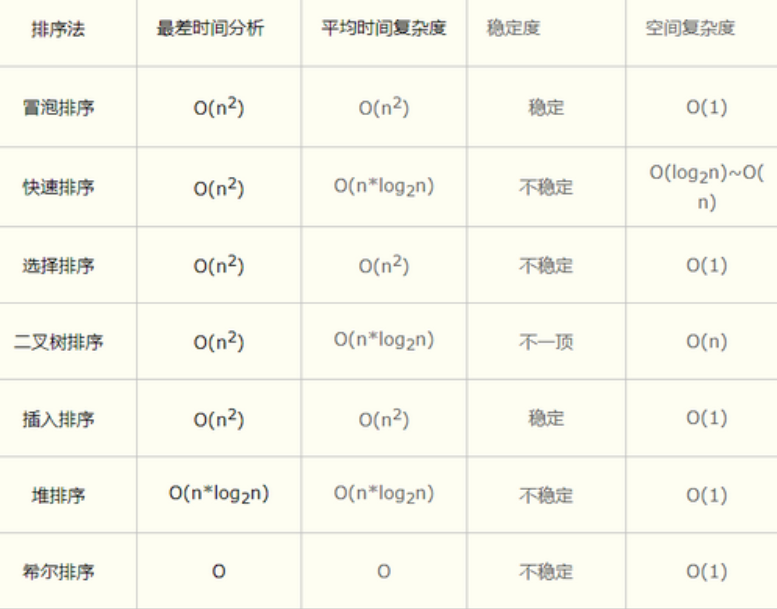

https://www.cnblogs.com/xiaonq/p/8573587.html

# 01.二分查找

```
l = list(range(1,101))
def bin_search(data_set,val):
   low = 0
   high = len(data_set) - 1
   while low <= high:
      mid = (low+high)//2
      if data_set[mid] == val:
         return mid
      elif data_set[mid] < val:
         low = mid + 1
      else:
         high = mid - 1
   return
n = bin_search(l,11)
print(n)            # 返回结果是： 10
```

# 02.low B三人组

## 2.1 冒泡

- **原理：**拿自己与上面一个比较，如果上面一个比自己小就将自己和上面一个调换位置，依次再与上面一个比较

- 第一轮结束后最上面那个一定是最大的数

````python
import random
def bubble_sort(li):
   for i in range(len(li) - 1):
      exchange = False
      for j in range(len(li) - i -1):  #内层for循环执行一次，选出一个最大值，将可以调换位置的数调整
         if li[j] > li[j + 1]:
            li[j],li[j+1] = li[j+1],li[j]
            exchange = True
      if not exchange:                # 如果上一趟没有发生交换就证明已经排序完成
         break
data = list(range(100))
random.shuffle(data)                  #将有序列表打乱
bubble_sort(data)
print(data)
````

## 2.2 选择

- 1、先假定第一个是最小的，依次与其他数比，如果其他数中有比第一个数小就假定这个更小的最小
- 2、再比，第一轮就可以找到最小的那个放到0号位置，然后在假定1号位置数最小与剩下比较，再找到第二小的数放到第1号位置

```python
import random
def select_sort(li):
   for i in range(len(li) - 1):
      min_loc = i                        #开始先假设0号位置的值最小
      for j in range(i+1, len(li)):      #循环无序区，依次比较，小于min_loc就暂定他的下标最小
         if li[j] < li[min_loc]:         #所以内层for循环每执行一次就选出一个小值
            min_loc = j
      li[i], li[min_loc] = li[min_loc],li[i]
       
li = [1,5,2,6,3,7,4,8,9,0]
select_sort(li)
print(li)               # [0, 1, 2, 3, 4, 5, 6, 7, 8, 9]
```

## 2.3 插入（比如码牌）

- 1、列表被分为有序区和无序区两个部分，最初有序区只有一个元素
- 2、每次从无序区选择一个元素，插入到有序区的位置，直到无序区变空

```python
import random

def insert_sort(li):
   for i in range(1, len(li)):
      tmp = li[i]     #tmp是无序区取出的一个数
      j = i - 1       #li[j]是有序区最大的那个数
      while j >= 0 and li[j] > tmp:
         # li[j]是有序区最大的数，tmp是无序区取出的一个数，tmp从有序区最大的那个数开始比
         # 小就调换位置，直到找到有序区中值不大于tmp的结束
         li[j+1]=li[j]    #将有序区最右边的数向右移一个位置
         j = j - 1
      li[j + 1] = tmp       #将tmp放到以前有序区最大数的位置，再依次与前一个数比较
data = list(range(100))
random.shuffle(data)        #将有序列表打乱
insert_sort(data)
print(data)
```

# 03.快排

## 3.1 快排-递归实现

**注：**快排代码实现（类似于二叉树 递归调用）----`右手左手一个慢动作，左手右手`一个慢动作重播

- `空间复杂度 O(1)`

```python
#!/usr/bin/env python
# -*- coding:utf-8 -*-
import random
import sys
sys.setrecursionlimit(10000000)             #设置系统最大递归深度

def quick_sort(data, left, right):
    if left < right:
        mid = partition(data, left, right)    # mid返回的是上一个用来排序那个数的下标
        quick_sort(data, left, mid - 1)
        quick_sort(data, mid + 1,right)

# 每执行一次partition函数都可以实现将某个数左边都比这个数小右边都比这个数大
def partition(data, left, right):
    tmp = data[left]
    while left < right:
        while left < right and data[right] >= tmp:     # 从右向左找小于tmp的数放到左边空位置
            right -= 1
        data[left] = data[right]                       # 将右边小于tmp值得数放到左边空位置
        while left < right and data[left] <= tmp:      # 从左向右找到大于tmp的值放到右边空位置
            left += 1
        data[right] = data[left]                       # 将右边大于tmp值得数放到右边空位置
    data[left] = tmp
    return left

data = list(range(100))
random.shuffle(data)                                 #将有序列表打乱
quick_sort(data, 0, len(data) - 1)
print(data)
```

## 3.2 快排-简单实现

- 空间复杂度高（`O(N)`）：需要开辟新的列表存储

```python
#! /usr/bin/env python
# -*- coding: utf-8 -*-
def quick(list):
    if len(list) < 2:
        return list

    tmp = list[0]  # 临时变量 可以取随机值
    left = [x for x in list[1:] if x <= tmp]  # 左列表
    right = [x for x in list[1:] if x > tmp]  # 右列表
    return quick(left) + [tmp] + quick(right)

li = [4,3,7,5,8,2]
print quick(li)  # [2, 3, 4, 5, 7, 8]

#### 对[4,3,7,5,8,2]排序
'''
[3, 2] + [4] + [7, 5, 8]                 # tmp = [4]
[2] + [3] + [4] + [7, 5, 8]              # tmp = [3] 此时对[3, 2]这个列表进行排序
[2] + [3] + [4] + [5] + [7] + [8]        # tmp = [7] 此时对[7, 5, 8]这个列表进行排序
'''
```

# 04.时间复杂度、空间复杂度和稳定性

## 4.1 各种算法比较

- 2层for循环都是 O（n²）
- log(n)：每次循环减半（二分查找）
- 快排：nlog(n)

 </img>


