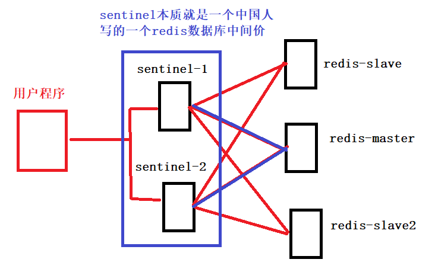
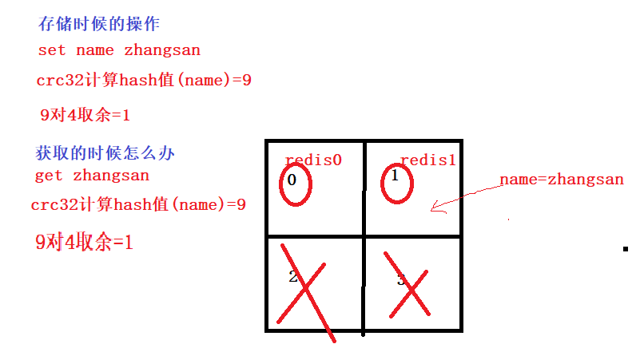
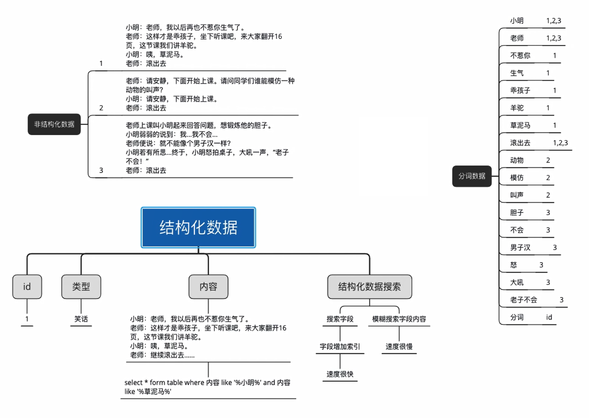

# 00. 项目技术点剖析

- 使用Redis实现分布式部署单点登录（单点登录第一种方法：redis分布式存储解决方案）
- 基于JWT技术及RSA非对称加密实现真正无状态的单点登录（单点等第二种方法：JWT）
- 用户登录对接QQ、微信、微博等三方登录
- 基于 Django 的后台管理平台，采用 RBAC 权限管理机制
- 结合DRF框架提供标准RESTful API接口
- 借助xterm.js、paramiko、Dwebsocket、SSH完成WebSSH在线编程
- 使用Ckeditor富文本编辑器完成后台管理
- 使用websocket完成在线直播推送消息
- redis集群实现秒杀和解决超卖问题
- 集成支付宝、微信、银联等进行聚合支付(怎么保证接口安全)
- 课程加入路径celery触发更新提醒
- 借助celery定时任务检查会员过期，过期改为普通会员
- 基于LocalStorage实现离线客户端购物车，减轻服务端压力。
- 基于Redis搭建高可用集群，实现可靠缓存服务即热点数据保存。redis持久化，集群，哨兵，主从，缓存击穿，热点key。
- 基于Redis和Mq来应对高可用高并发的秒杀场景
- 集成阿里云，视频采集、编辑、上传、分发加速、视频播放等
- 借助阿里云SLB对多台云服务器进行流量分发的负载均衡服务
- 使用nginx反向代理实现初步的请求负载均衡和请求限流，实现负载层水平扩容，消除单点故障提升应用系统的可用性
- 基于mysql实现数据库的读写分离和分库分表
- mysql解决超卖问题
- **使用Elasticsearch全文检索**
  - ES聚会索引
- **使用协同过滤算法实现课程推荐**
- **使用Supervisor对后台服务和uwsgi操作，降低日常维护成本**
- 线上服务发布过程（灰度发布）
- 排行榜实现
  - es / redis

- echarts
- mongodb评论
- docker+k8s


# 01.redis实现单点登录

> 使用Redis实现分布式部署单点登录（单点登录第一种方法：redis分布式存储解决方案）

因为这个项目是一个分布式部署的项目，而且我们采用的是nginx负载均衡的策略，导致了每一个服务器都需要开辟一个空间来进行用户信息的维护，消耗了大量的资源，所以，我当时使用到了Redis来作为维护用户信息的空间，将用户登录的信息存入Redis中，并且在存入时设置key的过期时间，所有的服务器共用一个Redis，每次进行操作时只需要去Redis中去判断这个用户是否存在，存在的话就说明这个用户现在是登录状态，不存在就说明这个用户没有登录，或者登录已经失效，让用户进行重新登录。

- 为什么会存在单点登录的问题
  - **session默认是存储在当前服务器的内存中**，如果是集群，那么只有登录那台机器的内存中才有这个session
  - 比如说我在A机器登录，B机器是没有这个session存在的，所以需要重新验证
- 如何解决这个单点登录问题
  - 不管在那一台web服务器登录，都会把token值存放到我们的一个集中管理的redis服务器中
  - 但客户端携带token验证的时候，会先从redis中获取，就实现单点登录
- 现实举例
  - 比如你写的一个tornado项目，分别部署到A，B两台机器上
  - 如果直接使用session，那么如果在A机器登录，token只会在A服务器的内存
  - 因为请求会封不到A，b连个机器，如果这个请求到了B机器，B的内存中没有就会让重新登录
  - 所以登录A机器的时候我们应该把token值写入到redis中，A/B机器登录，都从redis中获取token进行校验


# 02.JWT单点登录

> 基于JWT技术及RSA非对称加密实现真正无状态的单点登录（单点等第二种方法：JWT）


# 03.三方登录

> 用户登录对接QQ、微信、微博等三方登录

 </img>

# 04.RBAC角色权限管理机制

> 基于 Django 的后台管理平台，采用 RBAC 权限管理机制

- 用户表、角色表、权限表
  - 用户表：账号、姓名、邮箱、添加时间、最后登录时间、账号是否禁止登录
  - 角色表：商品管理员、订单管理员、超级管理员
  - 资源列表：资源名称（项目模块名称），资源路径（后台路由）
  - 资源分类：商品模块、订单模块、营销模块、权限模块、内容模块、其他模块
  -  </img>

#### RBAC角色权限管理机制实现思路

```python
# 面向资源编程
https://www.shiyanlou.com/v1/books/        # 请求后端 books书籍表中数据
	get
    post
# 用户表
# 角色表
# 权限表
get/post/put/delete 对应关系
```

- 所有权限的本质是对数据库中表中数据增删改查的操作
- 而这些增删改查的操作是通过前端不同路由，通过get、post、put、delete方法操作数据库的
- 对权限的控制，最简单的方法就是判断当前用户是否可以对指定路由请求操作的权限
- 把角色和这个角色能够访问的 url 和 请求方式进行关联（因为正是的业务逻辑用户权限划分力度可能非常细致）
- 再简单的业务逻辑中这一张表就是权限表

| 路由 资源(可能对应的是后端路由的 name名称，可以通过name名称解析出对应路由) | 请求方式 | 说明                              |
| ------------------------------------------------------------ | -------- | --------------------------------- |
| https://www.shiyanlou.com/v1/books/                          | get      | 判断用户是否可以查询books表中数据 |
| https://www.shiyanlou.com/v1/books/                          | post     | 判断用户是否可以添加books表中数据 |
| https://www.shiyanlou.com/v1/books/                          | put      | 判断用户是否可以更新books表中数据 |
| https://www.shiyanlou.com/v1/books/                          | delete   | 判断用户是否可以删除books表中数据 |

- 后端如何判断用户权限
  - 用户发送求方法 https://www.shiyanlou.com/v1/books/ 的url
  - 后端首先查询时哪一个用户，然后查询当前用户的角色
  - 最后判断这个角色是否可以访问 https://www.shiyanlou.com/v1/books/ 的对应方法即可
  - 如果这个角色有权限访问这个url就返回数据，不能访问就返回 401状态码


# 05.RESTful风格

> 结合DRF框架提供标准RESTful API接口

https://www.cnblogs.com/xiaonq/p/10053234.html

- restful说明
  - <span style="color: red"> RESTful不是一种技术，而是一种接口规范，主要规范包括：1.请求方式、2.状态码、3、url规范、4、传参规范</span>
  - RESTful核心是面向资源编程
    - 把所有数据都当做一个资源，在url中使用名词或者名词的复数形式表示这个资源
    - 以 get/post/put/delete 请求方式，来区别他们的增删改查动作

- 请求方式method
  - GET      ：从服务器取出资源（一项或多项）
  - POST    ：在服务器新建一个资源
  - PUT      ：在服务器更新资源（客户端提供改变后的完整资源）
  - PATCH  ：在服务器更新资源（客户端提供改变的属性）
  - DELETE ：从服务器删除资源

- **状态码**

```python
'''1. 2XX请求成功'''
#----- 200 请求成功，一般用于GET与POST请求
#----- 201 Created - [POST/PUT/PATCH]：用户新建或修改数据成功。

# 202 Accepted - [*]：表示一个请求已经进入后台排队（异步任务）
# 204 NO CONTENT - [DELETE]：用户删除数据成功。
'''2. 3XX重定向'''
#----- 301 NO CONTENT - 永久重定向
#----- 302 NO CONTENT - 临时重定向
'''3. 4XX客户端错误'''
# 400 INVALID REQUEST - [POST/PUT/PATCH]：用户发出的请求有错误。
#----- 401 Unauthorized - [*]：表示用户没有权限（令牌、用户名、密码错误）。
#----- 403 Forbidden - [*] 表示用户得到授权（与401错误相对），但是访问是被禁止的。
#----- 404 NOT FOUND - [*]：用户发出的请求针对的是不存在的记录。
# 406 Not Acceptable - [GET]：用户请求的格式不可得（比如用户请求JSON格式，但是只有XML格式）。
# 410 Gone -[GET]：用户请求的资源被永久删除，且不会再得到的。
# 422 Unprocesable entity - [POST/PUT/PATCH] 当创建一个对象时，发生一个验证错误。
'''4. 5XX服务端错误'''
#----- 500 INTERNAL SERVER ERROR - [*]：服务器内部错误，无法完成请求
# 501 Not Implemented     服务器不支持请求的功能，无法完成请求
```

- 面向资源编程： 路径，视网络上任何东西都是资源，均使用名词表示（可复数）
  - 所有请求实际操作的都是数据库中的表，每一个表当做一个资源
  - 资源是一个名称，所以RESTful规范中URL只能有名称或名词的复数形式
  - https://api.example.com/v1/zoos
  - https://api.example.com/v1/animals
  - https://api.example.com/v1/employees

- 过滤，通过在url上传参的形式传递搜索条件
  - https://api.example.com/v1/zoos?limit=10：指定返回记录的数量
  - https://api.example.com/v1/zoos?offset=10：指定返回记录的开始位置
  - https://api.example.com/v1/zoos?page=2&per_page=100：指定第几页，以及每页的记录数
  - https://api.example.com/v1/zoos?sortby=name&order=asc：指定返回结果按照哪个属性排序，以及排序顺序
  - https://api.example.com/v1/zoos?animal_type_id=1：指定筛选条件

> #### django的DRF

https://www.cnblogs.com/xiaonq/p/10987889.html

- 认证
- 权限
- 序列化
- 版本号
- 限流

**要求：对照上面的博客把，认证，权限，序列化**

# 06.websocket

websocket：https://www.cnblogs.com/xiaonq/p/12238651.html

webssh：https://www.cnblogs.com/xiaonq/p/12243024.html

> #### 2.websocket(3w1h)

- **什么是websocket**
  - webSocket是一种在单个TCP连接上进行全双工通信的协议
  - 客户端和服务器之间的数据交换变得更加简单，**允许服务端主动向客户端推送数据**。
  - 浏览器和服务器只需要完成一次握手，两者之间就直接可以创建持久性的连接，并进行双向数据传输
- **websocket与http区别**
  - http请求建立连接只能发送一次请求,不能有服务器端主动向客户端发送请求
  - websocket建立的长连接，一次连接，后续一直通信，这样节省资源，可以有客户端发送请求给服务器端
- **远古时期解决方案就是轮询**
  - 客户端以设定的时间间隔周期性地向服务端发送请求，频繁地查询是否有新的数据改动（浪费流量和资源）
- **webSocket应用场景？**
  -  **聊天软件：**最著名的就是微信，QQ，这一类社交聊天的app
  -  **弹幕：**各种直播的弹幕窗口
  -  **在线教育：**可以视频聊天、即时聊天以及其与别人合作一起在网上讨论问题…
- **websocket原理**
  - websocket首先借助http协议（通过在http头部设置属性，请求和服务器进行协议升级，升级协议为websocket的应用层协议）
  - 建立好和服务器之间的数据流，数据流之间底层还是依靠TCP协议；
  - websocket会接着使用这条建立好的数据流和服务器之间保持通信；
  - 由于复杂的网络环境，数据流可能会断开，在实际使用过程中，我们在onFailure或者onClosing回调方法中，实现重连
- websocket**实现心跳检测的思路**
  - 通过setInterval定时任务每个3秒钟调用一次reconnect函数
  - reconnect会通过socket.readyState来判断这个websocket连接是否正常
  - 如果不正常就会触发定时连接，每4s钟重试一次，直到连接成功
  - 如果是网络断开的情况下，在指定的时间内服务器端并没有返回心跳响应消息，因此服务器端断开了。
  - 服务断开我们使用ws.close关闭连接，在一段时间后，可以通过 onclose事件监听到。
- 实现聊天功能

```python
# 后端的django代码
from django.shortcuts import render
from dwebsocket.decorators import accept_websocket,require_websocket
from django.http import HttpResponse


def index(request):
    return render(request, 'index.html')

from dwebsocket.backends.default.websocket import DefaultWebSocket  # request.websocket就是DefaultWebSocket对象

tmp = []
# 只有加了这个装饰器，这个视图函数才能处理websocket请求
@accept_websocket
def echo(request):
    if not request.is_websocket():  #判断是不是websocket连接
        try:  #如果是普通的http方法
            message = request.GET['message']
            return HttpResponse(message)
        except:
            return render(request,'index.html')
    else:
        '''1.实现消息推送'''
        tmp.append(request.websocket)  # 把所有连接的websocket连接都加入列表中
        #  request.websocket = <dwebsocket.backends.default.websocket.DefaultWebSocket object at 0x00000272E69A4320>
        # failed:Invalid frame header：你的视图没有阻塞，请求过一次后服务器端就关闭连接了
        # 所以使用for循环 request.websocket 对象就会调用 __iter__()方法，利用迭代器进行阻塞
        for message in request.websocket:
            for ws in tmp:
                ws.send(message)

        '''2.实现聊天室思路'''
        # d = {}                                # 使用了一个dict来保存数据，
        # d['zhangsan'] = request.websocket     # key值是用户身份，value值是dict类型的{username:websocket}。
        # d['zhangsan'].send(message)           # 发送消息到客户端
        # d['lisi'].send(message)   ==>  request.websocket.send(message)

        # 这只是个思路，如果正式使用的话，肯定会对group封装，也不会只保存在内存中，需要保存到redis中去
        # 并且对每个websocket对象设置有效期，过期清除，避免长期挂起状态消耗系统资源等
```

```html
# 前端VUE代码
<template>
  <div>
    <button @click="send">发消息</button>
  </div>
</template>

<script>
  export default {
    data () {
      return {
        path:"ws://127.0.0.1:8000/echo?username=zhangsan&token=xxxx",
        socket:""
      }
    },
    mounted () {
      // 初始化
      this.init()
    },
    methods: {
      init: function () {
        if(typeof(WebSocket) === "undefined"){
          alert("您的浏览器不支持socket")
        }else{
          // 实例化socket
          this.socket = new WebSocket(this.path)
          // 监听socket连接
          this.socket.onopen = this.open
          // 监听socket错误信息
          this.socket.onerror = this.error
          // 监听socket消息
          this.socket.onmessage = this.getMessage
        }
      },
      open: function () {
        console.log("socket连接成功")
      },
      error: function () {
        console.log("连接错误")
      },
      getMessage: function (msg) {
        console.log(msg.data)         // 打印后台返回的数据
      },
      send: function () {
        var params = 'hahahahhahaha';
        this.socket.send(params)      // 发送给后台的数据
      },
      close: function () {
        console.log("socket已经关闭")
      }
    },
    destroyed () {
      // 销毁监听
      this.socket.onclose = this.close
    }
  }
</script>

<style>

</style>
```


# 07.redis实现秒杀超卖

> redis集群实现秒杀和解决超卖问题

- **redis命令：**https://www.cnblogs.com/xiaonq/p/7919111.html

- **redis解决超卖问题：**https://www.cnblogs.com/xiaonq/p/12328934.html


# 08.三方支付

> 集成支付宝、微信、银联等进行聚合支付(怎么保证接口安全)

支付宝支付：https://www.cnblogs.com/xiaonq/p/12332990.html

- 相关的资源：appid、支付宝公钥、app公钥、app私钥、django环境

- 流程

  - 生成公钥（app公钥、app私钥）
  - APP的公钥要上传到沙箱环境，然后我们要下载支付宝公钥

- 代码如何实现

  - 第一：生成支付的url
    - 在电脑本地生成公钥、私钥（app公钥、app私钥）
    - APP的公钥要上传到沙箱环境，然后我们要下载支付宝公钥
    - 提供（实例化Alipay对象）：appid、支付宝公钥、app私钥
    - 提供（拼接付款的url）：订单id、金额、标题、return_url(付款成功的回调接口)、notify_url(付款成功后的异步通知)
  - 第二：主动查询支付结果
    - 提供（实例化Alipay对象）：appid、支付宝公钥、app私钥
    - 提供一个 订单id就可以查询当前订单支付结果

 </img>

- 支付宝是如何保证数据安全的（数据传输如何保证安全）

  

# 09.celery异步任务定时任务

> 课程加入路径celery触发更新提醒

- celery原理

  

- celery应用场景

  - 异步任务
    - 发邮件、发送消息
    - 自动化工单中耗时任务
    - 所有需要异步处理的请求都可以
  - 定时任务
    - 工单系统定时获取超时工单进行延时报警
    - 对过期会员进行清理

- celery的场景（生产者消费者）可以使用多线程解决吗

  - 前端发送一个请求，执行自动化工单需要半个小时，这时候如果使用多线程页面会等待吗？

# 10.基于LocalStorage实现离线客户端购物车，减轻服务端压力。

- localStorage存储在浏览器本地
  - localStorage.setItem('key')
  - localStorage.getItem('key')
- sessionStorage缓存在前页面啦，关闭页面数据就被清除
  - sessionStorage.setItem('key2',456)
  - sessionStorage.getItem('key2')

# 11.基于Redis搭建高可用集群

> 实现可靠缓存服务即热点数据保存。redis持久化，集群，哨兵，主从，缓存击穿，热点key。

- redis有哪几种集群
  - 主从模式
  - 哨兵模式
  - codis
- redis主动同步机制
  - **RDB**
    - 全量同步：从服务器把有的数据全部丢弃，让主服务把所有数据全部发给他
  - **AOF**
    - 增量同步：主服务器只发送从服务器缺少的数据
  - **redis主从同步应该采用哪种方式**
    - 主从刚刚连接的时候，进行全量同步；全同步结束后，进行增量同步。
    - 当然，如果有需要，slave 在任何时候都可以发起全量同步。
    - redis 策略是，无论如何，首先会尝试进行增量同步，如不成功，要求从机进行全量同步。
- redis主从
  - 写主库、读从库，减轻服务器读压力
  - 缺点：但是redis主从不能自动切换master，所以master如果挂掉了，整个集群都不可以写入啦


- 哨兵模式如何解决主从问题

  - 当用Redis做主从方案时，假如master宕机，Redis本身无法自动进行主备切换
  - 而Redis-sentinel本身也是一个独立运行的进程，它能监控多个master-slave集群，发现master宕机后能进行自动切换。

- **sentinel原理**

  - sentinel负责持续监控主节点的健康，当主节挂掉时，自动选择一个最优的从节点切换成主节点
  - 从节点来连接集群时会首先连接sentinel，通过sentinel来查询主节点的地址
  - 当主节点发生故障时，sentinel会将最新的主节点地址告诉客户端，可以实现无需重启自动切换redis

  

  - sentinel缺点
    - redis的slave和master数据时完全一样的，但是有个问题，redis数据时存储在内存中
    - 内存空间有限，所以哨兵模式不能处理大的数据量

- codis

  - **为什么会出现codis**
    - 在大数据高并发场景下，单个redis实例往往会无法应对
    - 首先redis内存不易过大，内存太大会导致rdb文件过大，导致主从同步时间过长
    - 其次在CPU利用率中上，单个redis实例只能利用单核，数据量太大，压力就会特别

  - **codis部署方案**
    - 单个codis代理支撑的QPS比较有限，通过启动多个codis代理可以显著增加整体QPS
    - 多codis还能起到容灾功能，挂掉一个codis代理还有很多codis代理可以继续服务
    -  </img>

- **codis分片的原理**
  - codis负责将特定key转发到特定redis实例，codis默认将所有key划分为1024个槽位
  - 首先会对客户端传来的key进行crc32计算hash值，然后将hash后的整数值对1024进行取模，这个余数就是对应的key槽
  - 每个槽位都会唯一映射到后面的多个redis实例之一，codis会在内存中维护槽位和redis实例的映射关系
  - 这样有了上面key对应的槽位，那么它应该转发到那个redis实例就很明确了
  - 槽位数量默认是1024，如果集群中节点较多，建议将这个数值大一些，比如2048,4096




# 12.使用Elasticsearch全文检索

## 1.倒排索引

- `搜索引擎中存储的是倒排索引，就是分好的词，和词语文章的关联`

- 事先把文章使用分词打散，以词为依据，标记清楚对应的文章的编号

- 查询时
  - 把查询的语句也进行分词，然后根据分词，找到那些文章中包含了这些词

 </img>

## 2.django创建全文索引的过程

- 1.django中提供的是结构化数据（mysql中）
- 2.haystack（搜索框架）把结构化转非结构化
- 3.搜索引擎（ES，whoosh）把非结构化转分词

 </img>

# 13.使用协同过滤算法实现课程推荐

https://www.cnblogs.com/xiaonq/p/12797571.html

- 什么是协同过滤算法
  - 协同过滤推荐算法是诞生最早，并且较为著名的推荐算法，**主要的功能是预测和推荐**。
  - 算法通过对用户历史行为数据的挖掘发现用户的偏好，**基于不同的偏好对用户进行群组划分并推荐品味相似的商品**。
  - 协同过滤推荐算法分为两类，分别是**基于用户的协同过滤算法**(user-based collaboratIve filtering)，和**基于物品的协同过滤算法**(item-based collaborative filtering)。
  - 简单的说就是：人以类聚，物以群分。下面我们将分别说明这两类推荐算法的原理和实现方法。

- 的协同过滤算法
  - 协同过滤算法是一种基于关联规则的算法，以购物行为为例。
  - 假设有甲和乙两名用户，有a、b、c三款产品。
  - 如果甲和乙都购买了a和b这两种产品，我们可以假定甲和乙有近似的购物品味。
  - 当甲购买了产品c而乙还没有购买c的时候，我们就可以把c也推荐给乙。
  - 这是一种典型的user-based情况，就是以user的特性做为一种关联。
  - **举例：**　　　　
    - 1）直觉分析：“用户A/B”都喜欢物品A和物品B，从而“用户A/B”的口味最为相近
    - 2）因此，为“用户A”推荐物品时可参考“用户B”的偏好，从而推荐D

<span style="color: red"> 推荐算法的难点是建立数据模型和人物画像,要根据具体事物的特点来建立</span>

```
举例：
比如我最近买了一个华为手机，如果你最近总给我推荐什么？华为、小米的手机，这就是不合理的，因为手机使用周期很长，我可能一年都不会再有买手机的可能
比如我最近总吃樱桃，那么你可以推送车厘子给我，这种就算比较合理的，因为樱桃智能池两天
```

<span style="color: red"> 推荐算法代码中如何实现</span>

```python
# 第一步，将数据读取并格式化为字典形式，便于解析,(如果是数据库中数据，直接读取成字典即可)
# 第二步：借助"欧几里德"算法计算用户相似度（距离）
# 第三步：计算某个用户与其他用户的相似度
# 第四步：根据相似度最高的用户喜好商品排序，把相似度最高用户的喜好推荐给当前用户
```


# 14.使用Supervisor对后台服务和uwsgi操作，降低日常维护成本

https://www.cnblogs.com/xiaonq/p/12359448.html

- 1.什么是supervisor
  - Supervisor是用Python开发的一个client/server服务，是Linux/Unix系统下的一个进程管理工具，不支持Windows系统。、
  - 作用：它可以很方便的`监听、启动、停止、重启`一个或多个进程。
  - 用Supervisor管理的进程，当一个进程意外被杀死，supervisort监听到进程死后，会自动将它重新拉起
  - 很方便的做到`进程自动恢复的功能`，不再需要自己写shell脚本来控制。
  - 说白了，它真正有用的功能是俩个将非daemon(守护进程)程序变成deamon方式运行对程序进行监控，当程序退出时，可以自动拉起程序。
  - 但是它无法控制本身就是daemon的服务。


# 15.线上服务发布过程（灰度发布）

- 如果部署项目的集群数量很大，那么常用灰度发布（比如有三十台后端服务server）
  - 首先在一台机器上更新我们最新版本的代码，其余29台机器部署的是以前的代码，比较稳定（灰度发布）
  - 更新的那太机器，要看更新后的服务日志，如果用户访问，在监控中没有发现大量的 4xx/5xx错误
  - 证明新代码没问题，就会全量发布到身下的29机器中
- docker发布
  - docker运行机器服务是非常快速的，你可以把原有的部署在docker中的服务不用停止
  - 我只直接在机器上运行新的代码的docker，只需要在nginx的upstream里调整配置，指向新docker部署的服务即可
  - 完成上面步骤用户流量现在访问的就是新代码docker中服务，旧代码docker中就没有用户流量
  - 自己设定一个观察时间，如果新代码是问的的，可以直接关闭旧代码中的docker服务

# 16.排行榜实现

https://www.cnblogs.com/xiaonq/p/14268218.html

- es / redis


# 17.mongodb评论

https://www.cnblogs.com/xiaonq/category/1395492.html