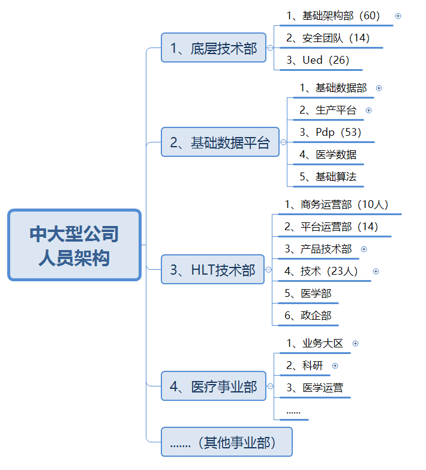
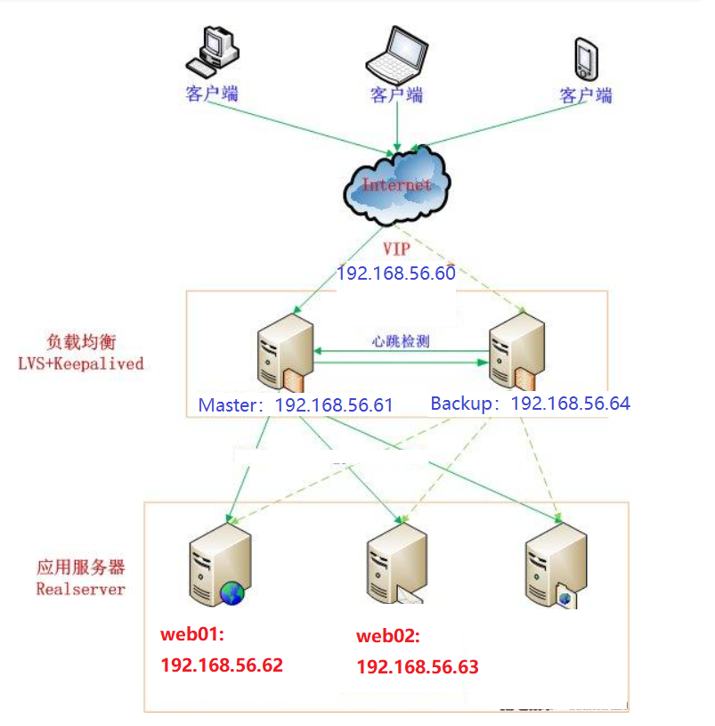
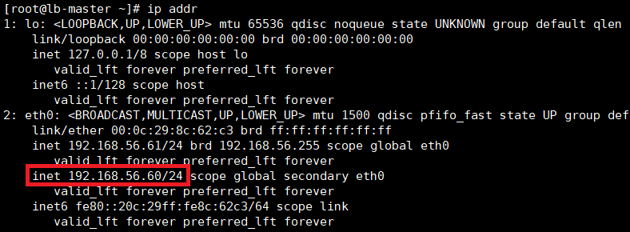

# 01.互联网公司组织架构

## 1.1 互联网公司人员介绍

### 1.1.1 中大型公司人架构（1000人上下）

 </img>

### 1.1.2 中小型公司人员架构（200人上下）

 </img>

## 1.2 公司开发环境介绍

- 开发环境
  - 本地电脑
  - 开发机器：
    - 给开发人员自己用的测试机器
    - 比较大的公司才会有（公司给每一个开发人员可能都会配置一个单独的机器作为开发机器，这个机器是线上的）
- 测试环境
  - 代码开发完毕后，把dev分支上新的代码部署到测试环境
  - 有专业的测试人员进行测试
- 沙箱环境/灰度环境
  - 代码全量上线前，在某一台机器中部署新的代码，观察上线后监控反馈的结果
  - 如果没有问题，在所有线上机器全量同步
  - 如果有报警，证明代码有问题，自动回到某一个稳定版本
- 线上环境
  - 在线上机群众部署的项目，直接给用户用的

- `注：200人一下的公司大多数都是使用云服务器`

# 02.项目人员组成

- 中小型项目一般研发组不会超过20人
  - 后端的数量一般是前端数量的三倍比较合适（比如：前端2人，后端6人，测试2人）
  - 一个产品人员正常会同时负责几个项目的跟进工作
  - 运维和网络是公共资源，所有项目组共同使用
- 项目中角色
  -  1）大前端（前端、安卓、IOS）
  -  2）后端（python、Java、Php、Go）
  -  3）产品
  -  4）运维和网络
- `普通app项目：建议说法`（项目不要说得太大，小项目即可）
  - Python后端 2 人
  - 大前端
    -  前端：1人
    -  安卓：1人
    -  IOS：1人
    - 注：大前端不一定都是这样，也可以是混合开发
  - 测试：1人（没有或者开发自己测试）
  - 产品：产品1人（小型项目很多时候产品负责多个项目，特别是100人一下公司，可能公司只有1到2个产品）
- `中型app项目：建议说法`（不建议大家把项目写的过大）
  - python后端：6人
  - 大前端
    -  前端：2人
    -  安卓：2人
    -  IOS：2人
    
    -  注：大前端不一定都是这样，也可以是混合开发
    
  - 测试：3人

# 03.Nginx反向代理方案

## 3.1 常规部署方案

| 角色              | IP            |
| ----------------- | ------------- |
| nginx反向代理服务 | 192.168.56.61 |
| web01             | 192.168.56.62 |
| web02             | 192.168.56.63 |

 </img>

## 3.2 Nginx反向代理

### 3.2.1 web01和web02安装nginx

- web01配置

```javascript
[root@linux-node4 ~]# yum -y install nginx
[root@linux-node4 ~]# echo web01 > /usr/share/nginx/html/index.html
```

- web02配置

```javascript
[root@linux-node4 ~]# yum -y install nginx
[root@linux-node4 ~]# echo web01 > /usr/share/nginx/html/index.html
```

- 测试nginx服务

```javascript
http://192.168.56.62/    # web01
http://192.168.56.63/    # web02
```

### 3.2.2 nginx反向代理配置

- `安装nginx服务器`

```javascript
[root@linux-node4 ~]# yum -y install nginx
```

- 配置反向代理

```javascript
stream {
    log_format  main  '$remote_addr $upstream_addr - [$time_local] $status $upstream_bytes_sent';
    access_log  /var/log/nginx/django-access.log  main;
    upstream django-apiserver {
                server 192.168.56.62:80;
                server 192.168.56.63:80;
            }
   
    server {
       listen 88;
       proxy_pass django-apiserver;
    }
}
```

- `完整配置如下`(看一下即可，都是nginx默认配置)

```javascript
[root@lb-master ~]# cat /etc/nginx/nginx.conf 
user  nginx;
worker_processes  1;
error_log  /var/log/nginx/error.log warn;
pid        /var/run/nginx.pid;
events {
    worker_connections  1024;
}

stream {
    log_format  main  '$remote_addr $upstream_addr - [$time_local] $status $upstream_bytes_sent';
    access_log  /var/log/nginx/django-access.log  main;
    upstream django-apiserver {
                server 192.168.56.62:80;
                server 192.168.56.63:80;
            }
   
    server {
       listen 80;
       proxy_pass django-apiserver;
    }
}

http {
    include       /etc/nginx/mime.types;
    default_type  application/octet-stream;
    log_format  main  '$remote_addr - $remote_user [$time_local] "$request" '
                      '$status $body_bytes_sent "$http_referer" '
                      '"$http_user_agent" "$http_x_forwarded_for"';
    access_log  /var/log/nginx/access.log  main;
    sendfile        on;
    #tcp_nopush     on;
    keepalive_timeout  65;
    #gzip  on;
    include /etc/nginx/conf.d/*.conf;
}
```

- `测试反向代理可用性`

```javascript
http://192.168.56.62/        # web01
http://192.168.56.63/        # web02
# 可以停止一个nginx服务，测试可用性
```

# 04.Nginx+KeepAlive方案

## 4.1 机器规划和架构图

| 角色                             | IP            |
| -------------------------------- | ------------- |
| nginx反向代理+`keepalive-master` | 192.168.56.61 |
| web01                            | 192.168.56.62 |
| web02                            | 192.168.56.63 |
| nginx反向代理+`keepalive-slave`  | 192.168.56.64 |

 </img>

## 4.2 部署nginx负载均衡

-  192.168.56.61（`keepalive-master`）
-  192.168.56.64（`keepalive-slave`）

### 4.2.1 配置nginx负载

- 安装nginx服务

```javascript
[root@linux-node4 ~]# yum -y install nginx
```

- 配置反向代理

```javascript
[root@lb-master ~]# vim /etc/nginx/nginx.conf
stream {
    log_format  main  '$remote_addr $upstream_addr - [$time_local] $status $upstream_bytes_sent';
    access_log  /var/log/nginx/django-access.log  main;
    upstream django-apiserver {
                server 192.168.56.62:80;
                server 192.168.56.63:80;
            }
   
    server {
       listen 88;
       proxy_pass django-apiserver;
    }
}
```

### 4.2.2 完整配置如下

- `看一下即可，都是nginx默认配置`

```javascript
[root@lb-master ~]# cat /etc/nginx/nginx.conf 
user  nginx;
worker_processes  1;
error_log  /var/log/nginx/error.log warn;
pid        /var/run/nginx.pid;
events {
    worker_connections  1024;
}

stream {
    log_format  main  '$remote_addr $upstream_addr - [$time_local] $status $upstream_bytes_sent';
    access_log  /var/log/nginx/django-access.log  main;
    upstream django-apiserver {
                server 192.168.56.62:80;
                server 192.168.56.63:80;
            }
   
    server {
       listen 80;
       proxy_pass django-apiserver;
    }
}

http {
    include       /etc/nginx/mime.types;
    default_type  application/octet-stream;
    log_format  main  '$remote_addr - $remote_user [$time_local] "$request" '
                      '$status $body_bytes_sent "$http_referer" '
                      '"$http_user_agent" "$http_x_forwarded_for"';
    access_log  /var/log/nginx/access.log  main;
    sendfile        on;
    #tcp_nopush     on;
    keepalive_timeout  65;
    #gzip  on;
    include /etc/nginx/conf.d/*.conf;
}
```

### 4.2.3 测试反向代理可用性

- 测试集群可用性

```javascript
http://192.168.56.62/        # web01
http://192.168.56.63/        # web02
# 可以停止一个nginx服务，测试可用性
```

- 服务管理

```javascript
[root@lb-slave ~]# systemctl start nginx
[root@lb-slave ~]# systemctl enable nginx
```

## 4.3 keepalive安装与配置

### 4.3.1 安装keepalive

```javascript
[root@lb-master ~]# yum -y install keepalived
```

### 4.3.2 keepalive-master配置修改

- ==注：默认的keepalived.conf配置太多，直接删除，用下面配置替换即可==
- `192.168.56.61`

```javascript
[root@lb-master ~]# vim /etc/keepalived/keepalived.conf 

global_defs { 
   notification_email { 
     acassen@firewall.loc 
     failover@firewall.loc 
     sysadmin@firewall.loc 
   } 
   notification_email_from Alexandre.Cassen@firewall.loc  
   smtp_server 127.0.0.1 
   smtp_connect_timeout 30 
   router_id NGINX_MASTER
} 

# 健康监测nginx
vrrp_script check_nginx {
    script "/etc/keepalived/check_nginx.sh"      # 设置检查nginx是否存活的脚本位置
}

# keepalive热备组配置
vrrp_instance VI_1 { 
    state MASTER            # 配置当前keepalive为master角色
    interface eth0           # 网卡名字，必须和实际网卡名称一致，默认是ens33
    virtual_router_id 51       # VRRP 路由 ID实例，每个实例是唯一的 
    priority 100            # 优先级，备服务器设置 90 
    advert_int 1            # 指定VRRP 心跳包通告间隔时间，默认1秒 
    authentication { 
        auth_type PASS      
        auth_pass 1111       # 设置keepalive的master和slave之间简单的秘钥认证
    }  
    virtual_ipaddress { 
        192.168.56.60/24     # 设置keepalive虚拟IP地址
    } 
    track_script {
        check_nginx
    } 
}
```

### 4.3.3 keepalive-slave配置修改

- ==注：默认的keepalived.conf配置太多，直接删除，用下面配置替换即可==

- `192.168.56.64`

```javascript
[root@lb-master ~]# vim /etc/keepalived/keepalived.conf 
 
global_defs { 
   notification_email { 
     acassen@firewall.loc 
     failover@firewall.loc 
     sysadmin@firewall.loc 
   } 
   notification_email_from Alexandre.Cassen@firewall.loc  
   smtp_server 127.0.0.1 
   smtp_connect_timeout 30 
   router_id NGINX_BACKUP
} 

vrrp_script check_nginx {
    script "/etc/keepalived/check_nginx.sh"
}

vrrp_instance VI_1 { 
    state BACKUP            # 设置keepalive角色为backend
    interface eth0           # 设置虚拟网卡名称
    virtual_router_id 51       # VRRP 路由 ID实例，每个实例是唯一的，master和slave保持一致即可
    priority 90             # 优先级，备服务器设置 90 
    advert_int 1            # 指定VRRP 心跳包通告间隔时间，默认1秒 
    authentication { 
        auth_type PASS      
        auth_pass 1111 
    }  
    virtual_ipaddress { 
        192.168.56.60/24     # 设置虚拟网卡地址
    } 
    track_script {
        check_nginx
    } 
}
```

### 4.3.4 添加nginx健康监测脚本

```javascript
[root@lb-master keepalived]# vim /etc/keepalived/check_nginx.sh
#!/bin/bash
count=$(ps -ef |grep nginx |egrep -cv "grep|$$")

if [ "$count" -eq 0 ];then
    exit 1
else
    exit 0
fi
[root@lb-master keepalived]# chmod +x /etc/keepalived/check_nginx.sh         # 给脚本添加一个可执行权限
```

### 4.3.5 启动keepalive

```javascript
[root@lb-master ~]#  systemctl start keepalived
[root@lb-master ~]#  systemctl enable keepalived
```

## 4.4 测试keepalive高可用

- 测试使用 http://192.168.56.60:88/ 虚拟IP访问
  - 在浏览器中访问: http://192.168.56.60   http://192.168.56.61   http://192.168.56.64  都可以访问web1和web2服务
- 关闭lb-master（192.168.56.61）的nginx测试VIP是否漂移到备节点
  - 在192.168.56.61中停止nginx服务（lb-master）,lb-slave中可以接替master的服务
  - 依然可以使用 http://192.168.56.60:88/ 访问web01和web02服务

 </img>


# 05.项目部署并发分析

## 5.1 并发常用名词

1. PV(访问量)： 页面访问量，页面刷新一次算一次。

2. UV(独立访客)： 即Unique Visitor，一个客户端（电脑，手机）为一个访客；

3. DAU(日活跃用户数)：登录或使用了某个产品的用户数，这与流量统计工具里的访客（UV）概念相似。

4. 峰值QPS：

　　　　原理：每天80%的访问集中在20%的时间里，这20%时间叫做峰值时间

　　　　公式：( 总PV数 * 80% ) / ( 每天秒数 * 20% ) = 峰值时间每秒请求数(QPS)

5. QPS/TPS(每秒查询率)：每秒能够查询次数（QPS/TPS= 并发数 / 平均响应时间）

　　　　并发数：并发数是指系统同时能处理的请求数量，这个也是反应了系统的负载能力。

　　　　吐吞量：吞吐量是指系统在单位时间内处理请求的数量

　　　　响应时间（RT）：响应时间是指系统对请求作出响应的时间，一般取平均响应时间

## 5.2 单台django性能分析

- 四核机器，可以开4个进程，每个进程开启50个线程
- 那么如果每个请求处理1秒，最多可以处理` 4 * 50  = 200` 个请求（`所以QPS=200`）
- 取决QPS主要因素：
  - CPU核数（核数越多，能够开启的进程数越多）
  - 接口返回时间（每个接口处理速度，所以也是在于我们对接口优化）

```javascript
[uwsgi]
socket = 0.0.0.0:3031
chdir = /code/mmcsite
wsgi-file = /code/mmcsite/wsgi.py
processes = 4
threads = 50
master = true
daemonize = /code/mmcsite/uwsgi.log
module=mmcsite.wsgi
pidfile = /code/mmcsite/uwsgi.pid
chmod-socket=666
enable-threads = true
```

# 06.nginx upstream五中配置

````python
1、轮询（默认）
每个请求按时间顺序逐一分配到不同的后端服务器，如果后端服务器down掉，能自动剔除。

upstream backserver {
    server 192.168.0.14;
    server 192.168.0.15;
}

2、权重 weight
指定轮询几率，weight和访问比率成正比，用于后端服务器性能不均的情况。

upstream backserver {
    server 192.168.0.14 weight=3;
    server 192.168.0.15 weight=7;
}

3、ip_hash（ IP绑定）
上述方式存在一个问题就是说，在负载均衡系统中，假如用户在某台服务器上登录了，那么该用户第二次请求的时候，因为我们是负载均衡系统，
每次请求都会重新定位到服务器集群中的某一个，那么已经登录某一个服务器的用户再重新定位到另一个服务器，其登录信息将会丢失，这样显然是不妥的。
我们可以采用ip_hash指令解决这个问题，如果客户已经访问了某个服务器，当用户再次访问时，会将该请求通过哈希算法，自动定位到该服务器。
每个请求按访问ip的hash结果分配，这样每个访客固定访问一个后端服务器，可以解决session的问题。

upstream backserver {
    ip_hash;
    server 192.168.0.14:88;
    server 192.168.0.15:80;
}

4、fair（第三方插件）
按后端服务器的响应时间来分配请求，响应时间短的优先分配。

upstream backserver {
    server server1;
    server server2;
    fair;
}

5、url_hash（第三方插件）
按访问url的hash结果来分配请求，使每个url定向到同一个后端服务器，后端服务器为缓存时比较有效。

upstream backserver {
    server squid1:3128;
    server squid2:3128;
    hash $request_uri;
    hash_method crc32;
}
````


